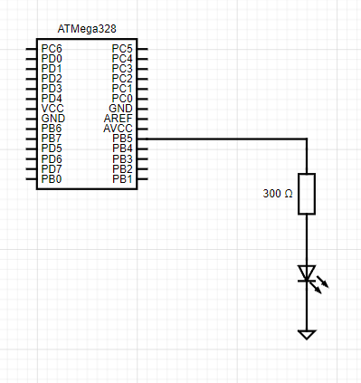

# 01-tools

### My repository
[My git - Tomáš Kříčka, 223283](https://github.com/TomasKricka/Digital-electronics-2)

<br>

### Logical funcion and symbols for C++
* `&`   - AND
* `|`   - OR
* `^`   - XOR
* `~`   - NOT
* `<<` - Bit shift to the left
* `>>` - Bit shift to the right

<br>

2. Truth table with `|`, `&`, `^`, `~`

| **b** | **a** |**b or a** | **b and a** | **b xor a** | **not b** |
| :-: | :-: | :-: | :-: | :-: | :-: |
| 0 | 0 | 0 | 0 | 0 | 1 |
| 0 | 1 | 1 | 0 | 1 | 1 |
| 1 | 0 | 1 | 0 | 1 | 0 |
| 1 | 1 | 1 | 1 | 0 | 0 |

<br>

### Code for Morse code
```c
#define LED_GREEN   PB5 // AVR pin where green LED is connected
#define SHORT_DELAY 250 // Delay in milliseconds
#define COMMA_DELAY 850 // dash delay
#define DOT_DELAY   450 // dot delay
#ifndef F_CPU           // Preprocessor directive allows for conditional
                        // compilation. The #ifndef means "if not defined".
# define F_CPU 16000000 // CPU frequency in Hz required for delay
#endif                  // The #ifndef directive must be closed by #endif

#include <util/delay.h> // Functions for busy-wait delay loops
#include <avr/io.h>     // AVR device-specific IO definitions

int main(void)
{
    // Set pin as output in Data Direction Register
    // DDRB = DDRB or 0010 0000
    DDRB = DDRB | (1<<LED_GREEN);

    // Set pin LOW in Data Register (LED off)
    // PORTB = PORTB and 1101 1111
    PORTB = PORTB & ~(1<<LED_GREEN);

    // Infinite loop
    while (1)
    {
        // Pause several milliseconds
        _delay_ms(SHORT_DELAY);             // short wait
        PORTB = PORTB | (1<<LED_GREEN);     // led is on
        _delay_ms(DOT_DELAY);               // led is on for DOT_DELAY
        PORTB = PORTB &~ (1<<LED_GREEN);    // led is off
        _delay_ms(SHORT_DELAY);             // shot delay between symlos
        PORTB = PORTB | (1<<LED_GREEN);     // led is on
        _delay_ms(COMMA_DELAY);             // led is on for COMMA_DELAY
        PORTB = PORTB &~ (1<<LED_GREEN);    // led in off
        _delay_ms(SHORT_DELAY);
    }

    // Will never reach this
    return 0;
}

```

<br>

### Schema
