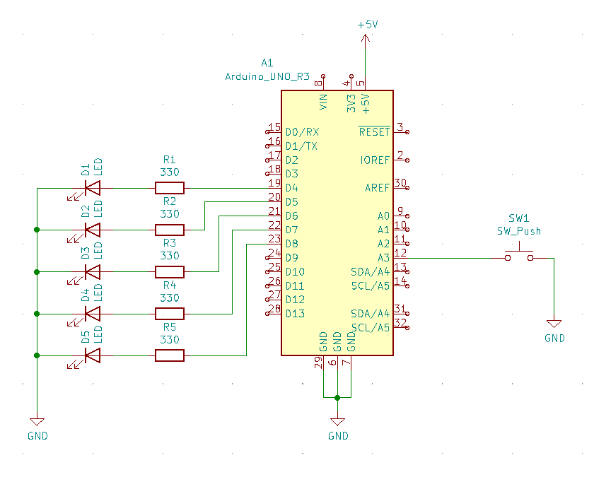

# Lab 2: Tomáš Kříčka

### My repository
[My git - Tomáš Kříčka, 223283](https://github.com/TomasKricka/Digital-electronics-2)

<br>

## 2. Active-low and active-high LEDs

| **DDRB** | **Description** |
| :-: | :-- |
| 0 | Input pin |
| 1 | Output pin|

| **PORTB** | **Description** |
| :-: | :-- |
| 0 | Output low value |
| 1 | Output high value|

| **DDRB** | **PORTB** | **Direction** | **Internal pull-up resistor** | **Description** |
| :-: | :-: | :-: | :-: | :-- |
| 0 | 0 | input | no | Low-impedance |
| 0 | 1 | input | yes | Pulled down |
| 1 | 0 | output| no | Low output |
| 1 | 1 | output | no | High output |

<br>


### Blinking together

```c
while(1)
{
    _delay_ms(BLINK_DELAY);
    PORTB = PORTB | (1<<LED_GREEN);
    PORTC = PORTC | (1<<LED_WHITE);
    _delay_ms(BLINK_DELAY);
    PORTB = PORTB &~ (1<<LED_GREEN);
    PORTC = PORTC &~ (1<<LED_WHITE);
}
```
<br>

## 4.Push button

```c
int main(void)
{

    DDRB = DDRB | (1<<LED_GREEN);
    PORTB = PORTB & ~(1<<LED_GREEN);

    
    DDRC = DDRC | (1<<LED_WHITE);
    PORTC = PORTC & ~(1<<LED_WHITE);

    
    DDRD = DDRD &~ (0<<BUTTON);
    PORTD = PORTD | (1<<BUTTON);

    while(1)
    {
        if (bit_is_clear(PIND ,BUTTON))
       {
            PORTB ^= (1<<LED_GREEN);
            PORTC ^= (1<<LED_WHITE);
            loop_until_bit_is_clear(PIND, BUTTON);
       }
    }
    return 0;
}
```
<br>

## Knight rider



