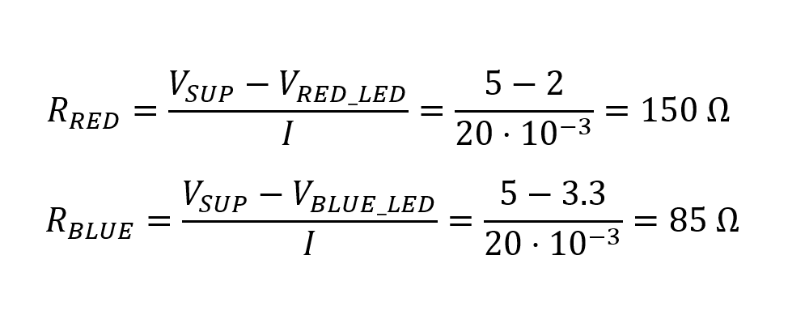

# 02-leds

### My repository
[My git - Tomáš Kříčka, 223283](https://github.com/TomasKricka/Digital-electronics-2)

 

## Preparation tasks

### Schema of LED active-low and LED active-high

### Rezistor calculation

 

| **LED color** | **Supply voltage** | **LED current** | **LED voltage** | **Resistor value** |
| :-: | :-: | :-: | :-: | :-: |
| red | 5&nbsp;V | 20&nbsp;mA | 2&nbsp;V | 150&nbsp;Ω |
| blue | 5&nbsp;V | 20&nbsp;mA | 3.3&nbsp;V | 85&nbsp;Ω |

 

### Schema of button active-low and button active-high

