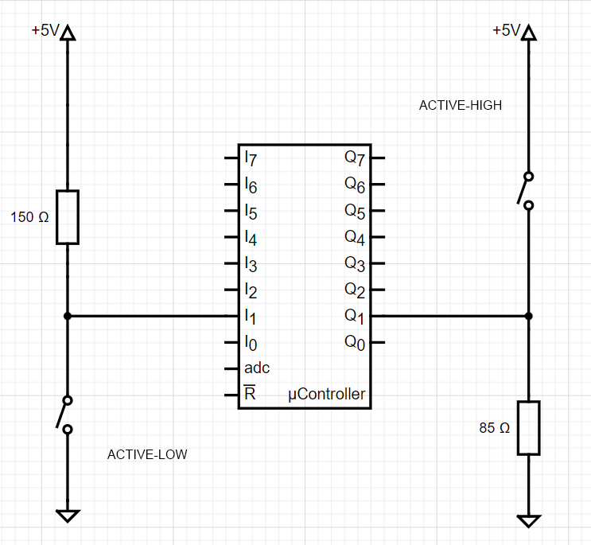

# 02-leds

### My repository
[My git - Tomáš Kříčka, 223283](https://github.com/TomasKricka/Digital-electronics-2)

 

## Preparation tasks

### Schema of LED active-low and LED active-high

### Rezistor calculation

 

| **LED color** | **Supply voltage** | **LED current** | **LED voltage** | **Resistor value** |
| :-: | :-: | :-: | :-: | :-: |
| red | 5&nbsp;V | 20&nbsp;mA | 2&nbsp;V | 150&nbsp;Ω |
| blue | 5&nbsp;V | 20&nbsp;mA | 3.3&nbsp;V | 85&nbsp;Ω |

 

### Schema of button active-low and button active-high

 

## Active-low and active-high LEDs

/* I/O ports page 100*/ 

| **DDRB** | **Description** |
| :-: | :-- |
| 0 | Input pin |
| 1 | |

| **PORTB** | **Description** |
| :-: | :-- |
| 0 | Output low value |
| 1 | Output high value|

| **DDRB** | **PORTB** | **Direction** | **Internal pull-up resistor** | **Description** |
| :-: | :-: | :-: | :-: | :-- |
| 0 | 0 | input | no | Tri-state, high-impedance |
| 0 | 1 | | | |
| 1 | 0 | | | |
| 1 | 1 | | | |

 

| **Port** | **Pin** | **Input/output usage?** |
| :-: | :-: | :-- |
| A | x | Microcontroller ATmega328P does not contain port A |
| B | 0 | Yes (Arduino pin 8) |
|   | 1 | Yes (Arduino pin 9) |
|   | 2 | Yes (Arduino pin 10)  |
|   | 3 | Yes (Arduino pin 11)  |
|   | 4 | Yes (Arduino pin 12)  |
|   | 5 |  Yes (Arduino pin 13) |
|   | 6 |  |
|   | 7 |  |
| C | 0 | Yes (Arduino pin A0) |
|   | 1 | Yes (Arduino pin A1) |
|   | 2 | Yes (Arduino pin A2)  |
|   | 3 | Yes (Arduino pin A3)  |
|   | 4 | Yes (Arduino pin A4/SDA)  |
|   | 5 | Yes (Arduino pin A5/SCL)  |
|   | 6 |  |
|   | 7 |  |
| D | 0 | Yes (Arduino pin RX<-0) |
|   | 1 | Yes (Arduino pin TX->1)  |
|   | 2 | Yes (Arduino pin 2)  |
|   | 3 |  |
|   | 4 |  |
|   | 5 |  |
|   | 6 |  |
|   | 7 |  |

