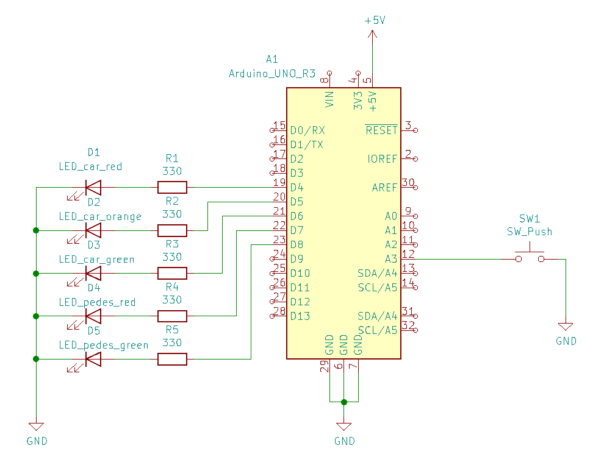

# Lab 3: Tomáš Kříčka

### My repository
[My git - Tomáš Kříčka, 223283](https://github.com/TomasKricka/Digital-electronics-2)

<br>


### Table with data types in C

| **Data type** | **Number of bits** | **Range** | **Description** |
| :-: | :-: | :-: | :-- | 
| `uint8_t`  | 8 | 0, 1, ..., 255 | Unsigned 8-bit integer |
| `int8_t`   | 8 | -128, ..., 127 | Signed 8-bit integer |
| `uint16_t` | 16 | 0, 1, ..., 65 535 | Unsigned 16-bit integer |
| `int16_t`  | 16 | -32768, ..., 32767 | Signed 16-bit integer |
| `float`    | 32 | -3.4e+38, ..., 3.4e+38 | Single-precision floating-point |
| `void`     | 0 | / | Pointer to unknown type of data |

<br>

### Functions
In your words, describe the difference between the declaration and the definition of the function in C.

* Function declaration -> There is define name and data type of function
* Function definition -> Code is performing special task

<br>

### Code which toggles LEDs only if push button is pressed

Part of the C code listing with syntax highlighting, which toggles LEDs only if push button is pressed. Otherwise, the value of the LEDs does not change. Use function from your GPIO library. Let the push button is connected to port D:

```c
int main (void)
{
    // Configure Push button at port D and enable internal pull-up resistor
    // WRITE YOUR CODE HERE

    GPIO_config_input_pullup(&DDRD, BUTTON);

    // Infinite loop
    while (1)
    {
        // WRITE YOUR CODE HERE

        if (GPIO_read(&PIND, BUTTON) == 0) 
        {
            _delay_ms(BLINK_DELAY);
            GPIO_toggle(&PORTC, LED_RED);
            GPIO_toggle(&PORTB, LED_GREEN);            
        }

    }
}

```
<br>

## Traffic light
Scheme of traffic light application with one red/yellow/green light for cars and one red/green light for pedestrians. Connect AVR device, LEDs, resistors, one push button (for pedestrians), and supply voltage. The image can be drawn on a computer or by hand. Always name all components and their values!

