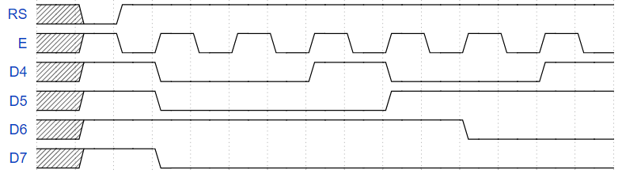
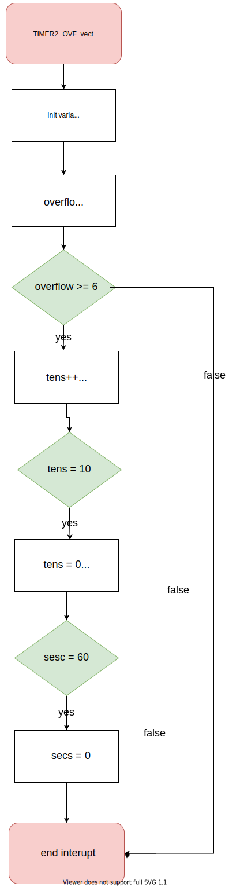
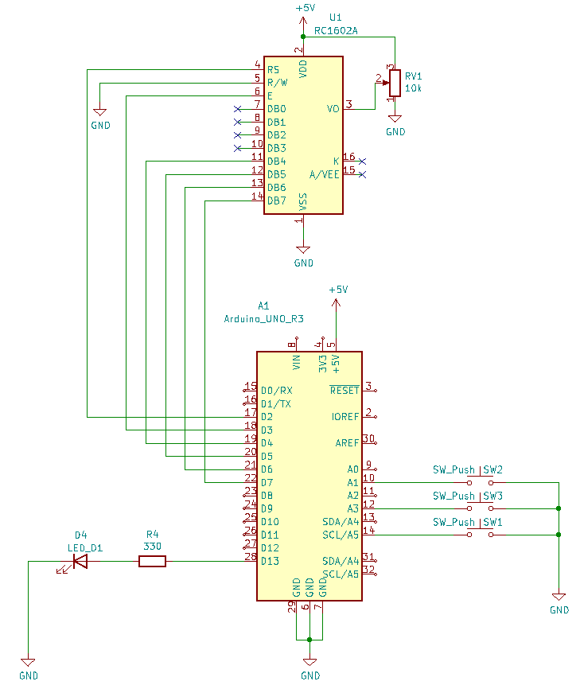

# Lab 6: Tomáš Kříčka

### My repository
[https://github.com/TomasKricka/Digital-electronic-2](https://github.com/TomasKricka/Digital-electronics-2)

<br>

### LCD display module

1. In your words, describe what ASCII table is.
   * ASCII - table where is defined letters, numbers and symbols, used for programing

2. (Hand-drawn) picture of time signals between ATmega328P and LCD keypad shield (HD44780 driver) when transmitting three character data `De2`.

   


### Stopwatch

1. Flowchart figure for `TIMER2_OVF_vect` interrupt service routine which overflows every 16&nbsp;ms but it updates the stopwatch LCD approximately every 100&nbsp;ms (6 x 16&nbsp;ms = 100&nbsp;ms). Display tenths of a second and seconds `00:seconds.tenths`. Let the stopwatch counts from `00:00.0` to `00:59.9` and then starts again. The image can be drawn on a computer or by hand. Use clear descriptions of the individual steps of the algorithms.

   


### Custom characters

1. Code listing with syntax highlighting of two custom character definition:

```c
/* Variables ---------------------------------------------------------*/
// Custom character definition
uint8_t customChar[16] = {
    // WRITE YOUR CODE HERE

    0b10101,    //chessboard
	0b01010,
	0b10101,
	0b01010,
	0b10101,
	0b01010,
	0b10101,
	0b01010

    0b01110,    // Space invader
	0b00100,
	0b00100,
	0b01010,
	0b01010,
	0b00100,
	0b01010,
	0b10001

};
```


### Kitchen alarm

Consider a kitchen alarm with an LCD, one LED and three push buttons: start, +1 minute, -1 minute. Use the +1/-1 minute buttons to increment/decrement the timer value. After pressing the Start button, the countdown starts. The countdown value is shown on the display in the form of mm.ss (minutes.seconds). At the end of the countdown, the LED will start blinking.

1. Scheme of kitchen alarm; do not forget the supply voltage. The image can be drawn on a computer or by hand. Always name all components and their values.

   


